# 🎨 Mockups y Diseño de Interfaz (UI/UX)

Este documento centraliza todas las referencias visuales, wireframes y mockups de la plataforma **Synapse**. 

Mantener el diseño aquí permite que los desarrolladores frontend tengan una referencia clara sin saturar la documentación técnica del proyecto.

---

## 🔗 Enlaces Oficiales de Diseño

Si tu equipo utiliza herramientas de diseño colaborativo, deja los enlaces aquí:

- **Figma / Adobe XD:** `[Pega aquí tu enlace de Figma]`
- **Miro (Flujos de usuario):** `[Pega aquí tu enlace del flujo]`

---

## 🖼️ Pantallas Principales

Las imágenes de diseño están divididas en dos carpetas dentro de este directorio:
- Carpeta `desktop/`: Diseños para pantallas grandes (PC, Laptops).
- Carpeta `mobile/`: Diseños adaptativos (Responsive) para teléfonos.

*(Instrucciones: Solo tienes que pegar tus imágenes dentro de las carpetas `desktop` o `mobile` según corresponda, y cambiar los nombres abajo para que coincidan).*

### 1. Landing Page (Página de Inicio)

**🖥️ Vista Computador (Desktop):**
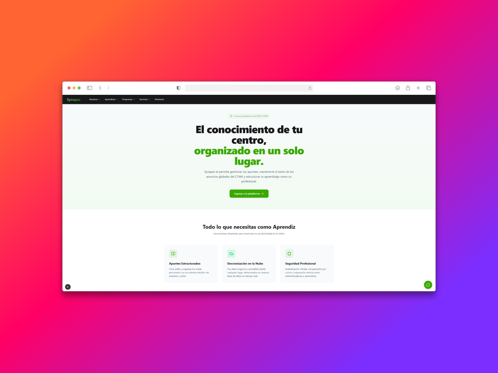

**📱 Vista Móvil (Responsive):**
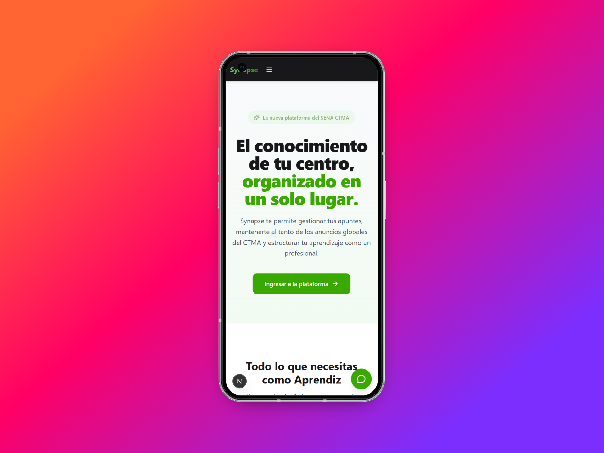

---

### 2. Autenticación (Login)

**🖥️ Vista Computador (Desktop):**
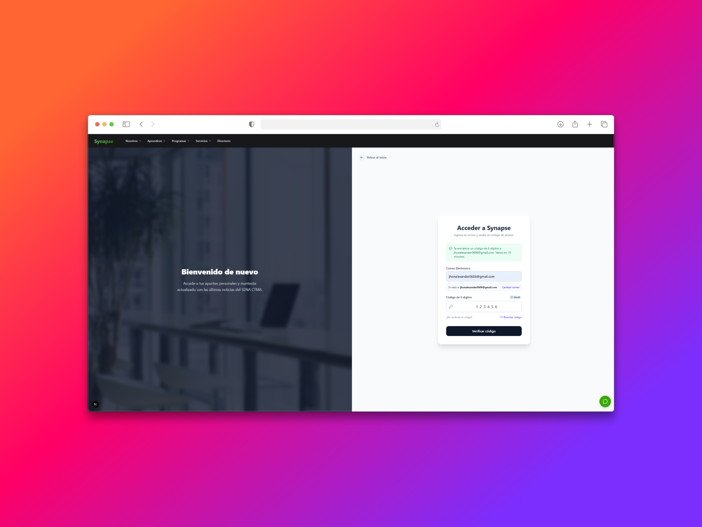

**📱 Vista Móvil (Responsive):**
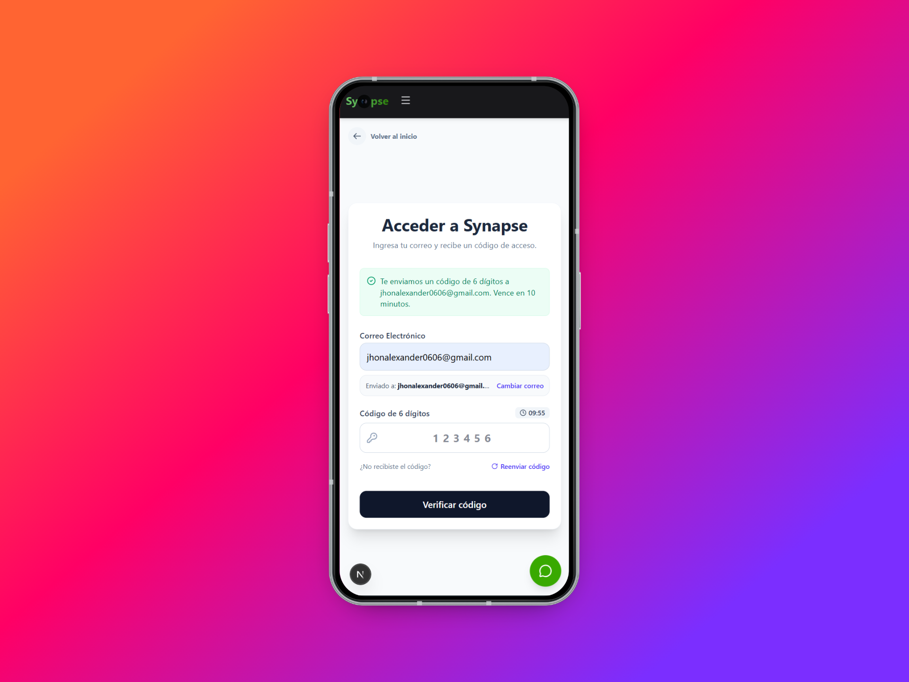

---

### 3. Dashboard Principal

**🖥️ Vista Computador (Desktop):**
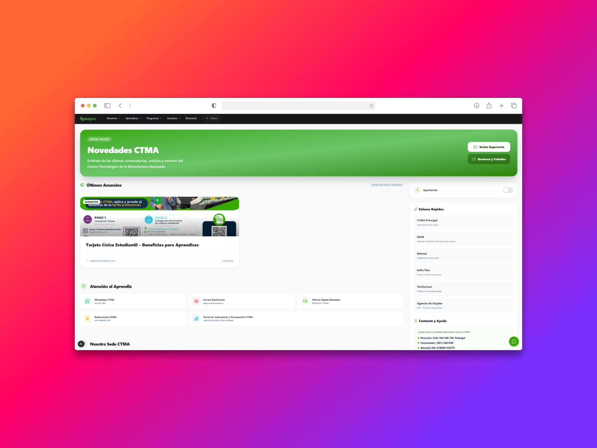

**📱 Vista Móvil (Responsive):**
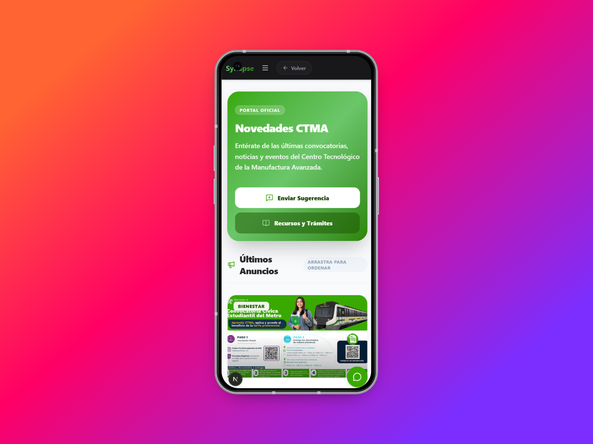

---

### 4. Interfaz del ChatBot

**🖥️ Vista Computador (Desktop):**
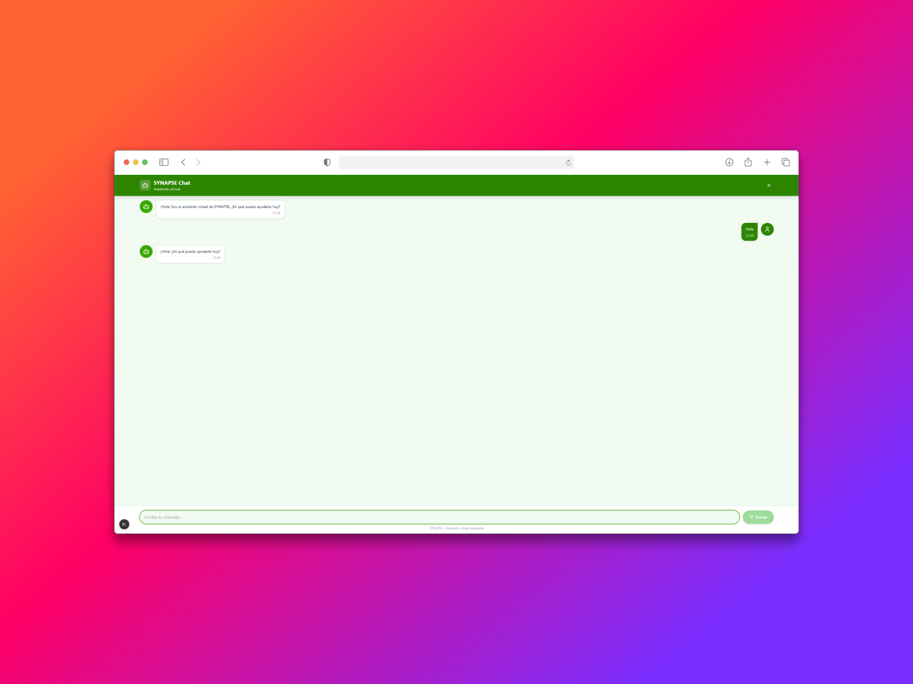

**📱 Vista Móvil (Responsive):**
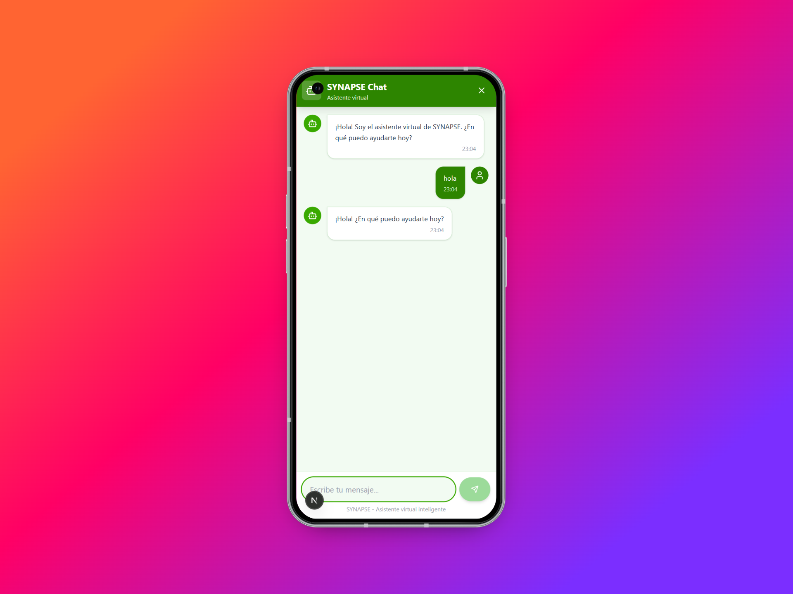

---

### 5. Menú de Navegación

**🖥️ Vista Computador (Desktop):**
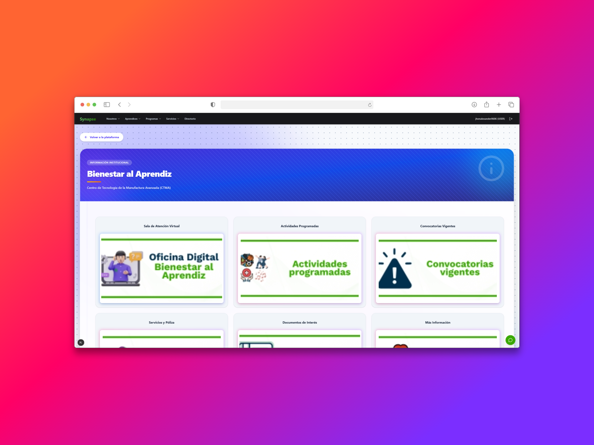
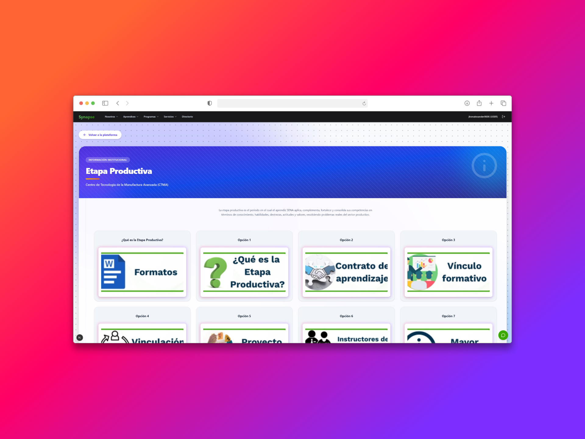

**📱 Vista Móvil (Responsive):**

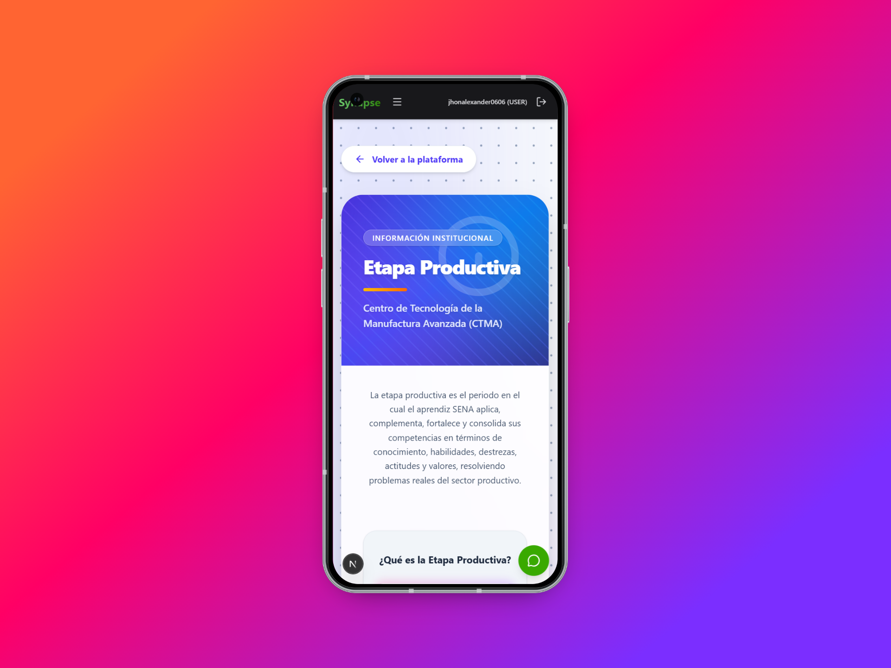

---

### 6. Sugerencias

**🖥️ Vista Computador (Desktop):**
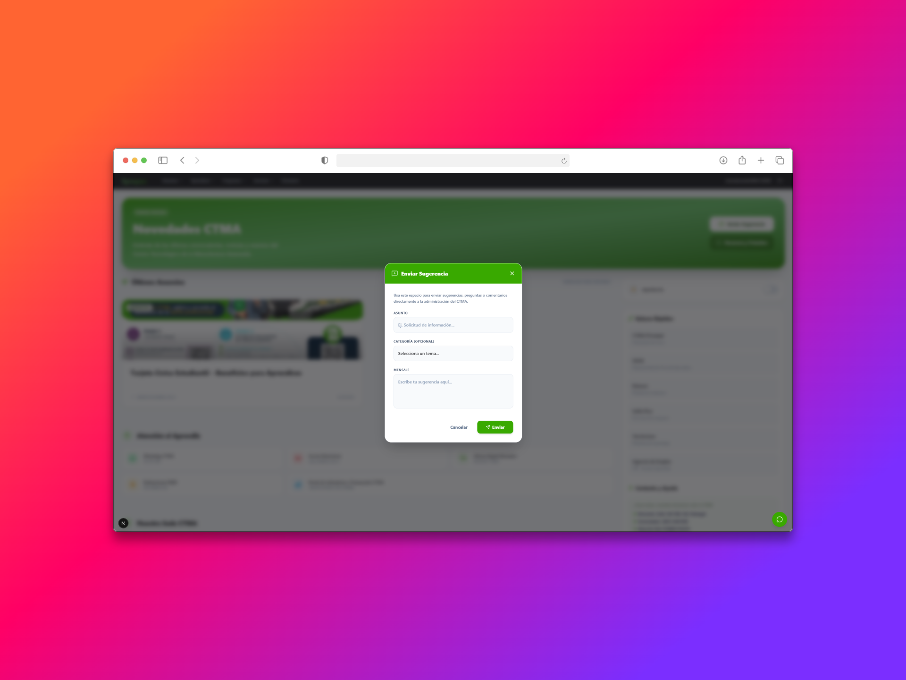

**📱 Vista Móvil (Responsive):**
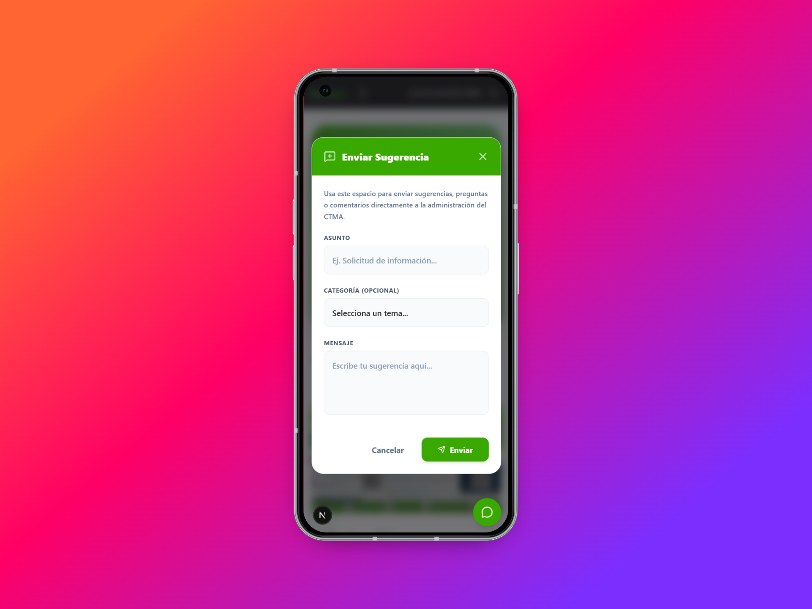

---

## 🎨 Sistema de Diseño (Design System)

### Paleta de Colores
- **🟢 Verde Institucional SENA:** `#39A900`
- **🌿 Verdes Complementarios:** Desde `#F2FBF2` hasta `#0B2600`
- **🔥 Naranja de Acento:** `#FF6E00`
- **⚪ Fondo Claro:** `#F8FAFC`
- **🌑 Texto Oscuro:** `#0F172A`
- **🩶 Neutros:** Escalas de `slate`, `zinc`, `blanco` y `gris`
- **🌈 Acentos Secundarios:** `azul`, `índigo`, `rojo`, `ámbar`, `celeste` y `esmeralda`
- **🌙 Modo Oscuro:** Principalmente `zinc-800`, `slate-900` y `slate-800`

### Tipografía
- **Títulos y Encabezados:** `Geist Sans` *(Pesos: Bold, ExtraBold, Black)*
- **Cuerpo de texto general:** `Geist Sans` *(Tipografía moderna, limpia y sans-serif)*
- **Código / Contenido técnico:** `Geist Mono`

---
*Nota para el equipo de desarrollo: Siempre revisar la versión más reciente en el enlace de Figma antes de comenzar la maquetación en React/Next.js.*
